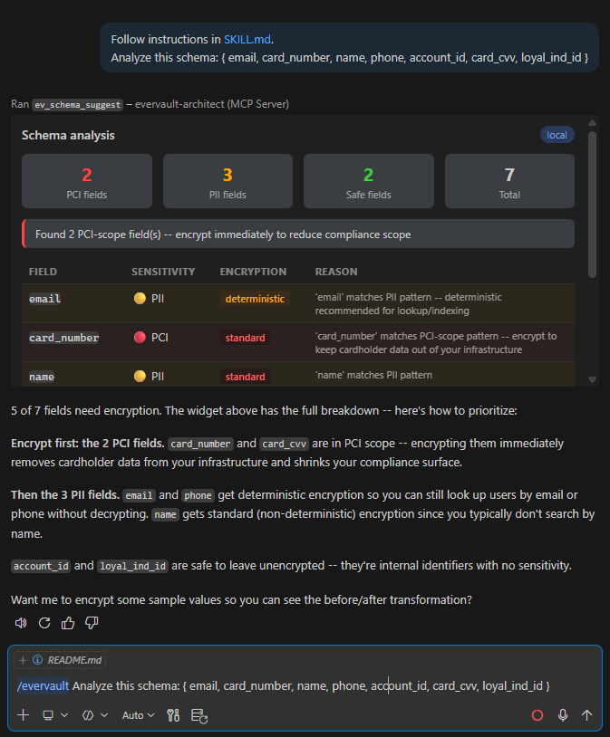
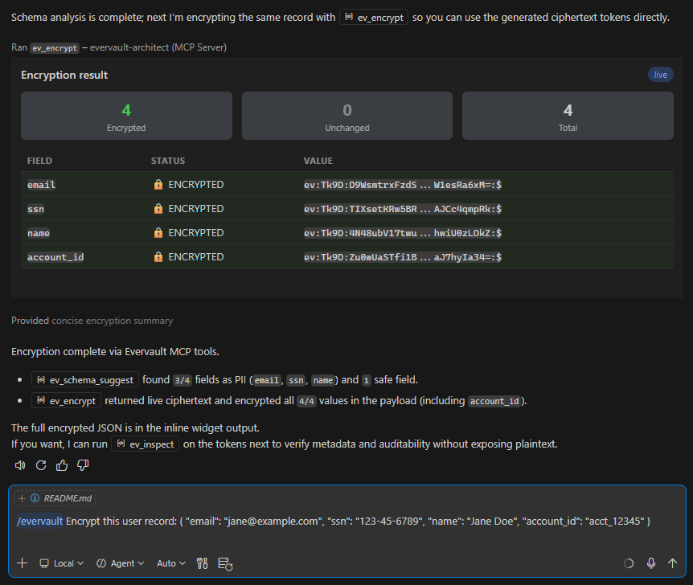
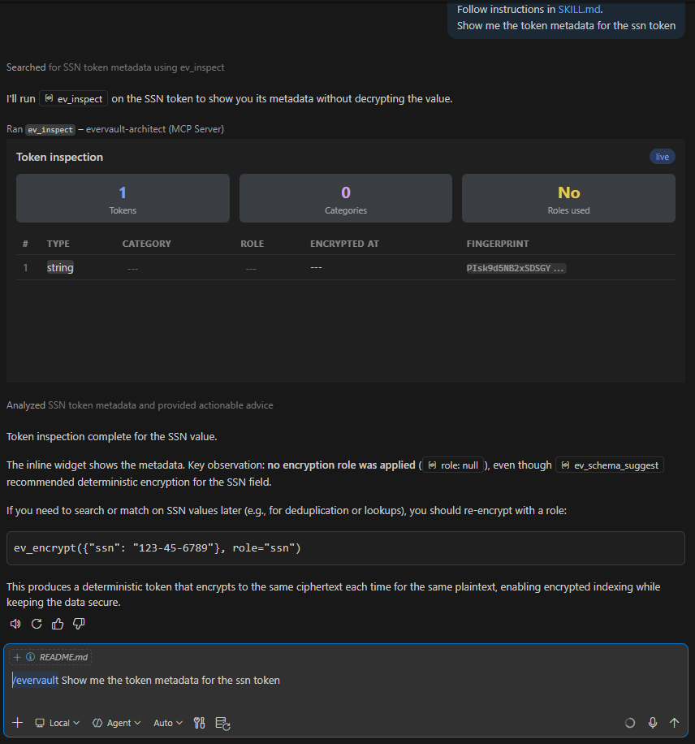

# Evervault Architect MCP

**Architect, deploy, and audit Evervault security infrastructure in your IDE**

This MCP server gives your AI agent access to [Evervault](https://docs.evervault.com/). Encrypt data, create Relay proxies, run secure Functions, and analyze schemas for PII implications or PCI compliance.

## Scenario 1: 

| `/evervault` Analyze <br>this schema: | Encrypt this <br>user record: | Show me the <br>token metadata for: |
| :---: | :----: | :----: |
| <kbd></kbd> | <kbd></kbd> | <kbd></kbd> | 

## Scenario 2: 

| `/evervault` Set up a Relay <br>to intercept card data: | Look up in the <br>documentation ... | ... |
| :---: | :----: | :----: |
| <kbd>...</kbd> | <kbd>...</kbd> | <kbd>...</kbd> |


## Overview

In your IDE, use slash command `/evervault`:

**``/evervault`` Analyze our user-service schema and tell me what's exposed**<br>
**Agent:** Scans the schema, highlights PII fields, recommends encryption types. Renders a color-coded sensitivity tree in the chat.

**``/evervault`` Encrypt this sample user payload** <br>
**Agent:** Calls the Evervault Encrypt API. Shows a before/after diff – plaintext → ev:encrypted: ...

**``/evervault`` Set up a Relay to intercept card data before it hits our DB**<br>
**Agent:** Creates a Relay via the API. Shows a route map widget: source → Relay → destination.


---

## Install

### Prerequisites

- Python 3.11+
- [uv](https://docs.astral.sh/uv/) (Python package manager)
- Node.js 20+ (for building widgets)
- VS Code with GitHub Copilot or compatible MCP host
- Evervault account with API credentials

### Install from GitHub (recommended)

```bash
uvx --from git+https://github.com/V-You/evervault-architect-mcp evervault-mcp
```

### Install for local development

```bash
git clone https://github.com/V-You/evervault-architect-mcp.git
cd evervault-architect-mcp
uv sync
uv run python -m evervault_mcp
```

### Environment variables

Create a `.env` file in the project root:

```env
EV_APP_ID=app_77b94737782c
EV_API_KEY=your_api_key_here
EV_DEMO_MODE=auto-fallback    
# live | mock | auto-fallback (default)
```

> **Note:** Live Evervault API calls require `EV_APP_ID` and `EV_API_KEY`. A Team ID is not used by the API client.
>
> When the server is installed via `uvx`, it loads `.env` from the current workspace by default. If your MCP host starts the server outside the project root, export the variables before launch or set `EVERVAULT_MCP_ENV_FILE` to the absolute path of the `.env` file.
>
> To force real API calls and surface errors instead of falling back to fixtures, set `EV_DEMO_MODE=live` while validating your setup.

### VS Code MCP configuration

Add to `.vscode/mcp.json`:

```json
{
  "servers": {
    "evervault-architect": {
      "command": "uvx",
      "args": ["--from", "git+https://github.com/V-You/evervault-architect-mcp", "evervault-mcp"]
    }
  }
}
```

---

## Usage

### IDE Skills

| Skill | Persona | When to use |
|---|---|---|
| `/evervault` | Product Developer | *"Set up encryption for my checkout flow"* |
| `/evervault-security` | Security Architect | *"Audit our encryption posture"* |

### Example interactions

**Schema analysis:**
```
> Analyze this JSON schema for PII:
> { "name": "string", "email": "string", "card_number": "string", "address": "string" }
```

**Live encryption:**
```
> Encrypt this payload: { "email": "jane@example.com", "ssn": "123-45-6789" }
```

**Relay creation:**
```
> Create a Relay for api.example.com that encrypts card_number and cvv on POST /checkout
```

**Documentation query:**
```
> What's the difference between Relay and Functions?
```

---

## Architecture

```
IDE (VS Code)
  ├── /evervault             (Skill – developer persona)
  ├── /evervault-security    (Skill – security persona)
  └── LLM routes intent
        ↓
  evervault_mcp/server.py    (FastMCP, stdio transport)
    ├── ev_encrypt            →  POST /encrypt             →  ui://encrypt-result.html
    ├── ev_inspect            →  POST /inspect             →  ui://inspect-result.html
    ├── ev_relay_create       →  POST /relays                        →  ui://relay-config.html
    ├── ev_relay_list         →  GET  /relays                        →  ui://relay-dashboard.html
    ├── ev_function_run       →  POST /functions/{function_name}/runs →  ui://function-run.html
    ├── ev_schema_suggest     →  local pattern matching               →  ui://schema-analysis.html
    └── ev_docs_query         →  bundled docs_context.md              →  ui://docs-panel.html
```

**Transport:** stdio (local). Server runs as a child process of the IDE.

**MCP Apps:** Each tool declares a `ui://` resource via FastMCP's `AppConfig`. The host (VS Code) fetches the HTML via `resources/read` and renders it inside the Chat window -- interactive widgets served directly over the MCP protocol.

### MCP Apps implementation


<details>
  <summary>Click to expand</summary>

(Remove, once all widgets work)

Three pieces must be wired together for a widget to render inline:

**1. `ui://` resource** -- serves the self-contained HTML.

```python
@mcp.resource("ui://evervault-architect/schema-analysis.html")
def schema_analysis_widget() -> str:
    """Interactive schema analysis widget."""
    return render_schema_analysis(_last_results.get("schema_analysis", {}))
```

The `ui://` URI scheme auto-sets the MIME type to `text/html;profile=mcp-app`.

**2. `AppConfig` on the tool** -- tells the host which resource to render.

```python
@mcp.tool(
    app=AppConfig(resource_uri="ui://evervault-architect/schema-analysis.html"),
)
```

FastMCP merges this into `_meta.ui.resourceUri` on the wire, which the host reads during `tools/list`.

**3. `ToolResult` return value** -- separates LLM-facing text from widget data.

```python
from fastmcp.tools.tool import ToolResult
from mcp.types import TextContent

return ToolResult(
    content=[TextContent(type="text", text="Concise directive for the LLM")],
    structured_content=widget_payload,
    meta={"ui": {"resourceUri": "ui://evervault-architect/<widget-name>.html"}},
)
```

The `meta` dict becomes `_meta` on the wire. VS Code needs `_meta.ui.resourceUri` in the **tool call response** to trigger widget rendering -- this is separate from (and in addition to) `AppConfig`, which only populates `_meta` in `tools/list`. Passing `meta={}` causes an empty `_meta: {}` on the wire, and the host silently skips rendering.

**Anti-duplication balance:** The `structured_content` dict is visible to both the widget JS and the model. There is a trade-off: summary-only payloads reduce model duplication, but can leave the widget without row data when `ui://` HTML is pre-fetched before tool execution. Prefer sending full widget hydration data (or at least all fields needed to rebuild the DOM) in `structured_content`, then use concise `content` instructions so the model summarizes instead of repeating tables.

**Adding a new widget:**

1. Write a `render_*()` function in `widgets.py` that returns a self-contained HTML string (use VS Code CSS variables like `--vscode-foreground` for theme integration)
2. The HTML **must** include a `<script>` that performs the MCP Apps handshake via `postMessage` -- without it, the host won't display the iframe:
   - Send request: `"ui/initialize"` with `protocolVersion: "2026-01-26"`, `appCapabilities: {}`, `appInfo: { name, version }`
   - Send notification: `"ui/notifications/initialized"`
   - Listen for: `"ui/notifications/tool-result"` (receives `structuredContent`), `"ui/notifications/host-context-changed"` (theme vars)
   - **Do not** use unprefixed `"initialize"` or camelCase `"hostContextChanged"` -- these silently fail. See `widgets.py` for the minimal template
3. Use the URI convention `ui://evervault-architect/<widget-name>.html`
4. Register a `@mcp.resource("ui://evervault-architect/<widget-name>.html")` that calls the renderer
5. Add `app=AppConfig(resource_uri="ui://evervault-architect/<widget-name>.html")` to the `@mcp.tool()` decorator
6. Return `ToolResult(content=..., structured_content=..., meta={"ui": {"resourceUri": "ui://evervault-architect/<widget-name>.html"}})` from the tool
7. Store the full result in `_last_results` so the resource handler can serve it on subsequent reads

**Gotchas (updated 2026-03-01):**

- `meta={}` produces `_meta: {}` on the wire -- VS Code ignores it. You must explicitly pass `ui.resourceUri` in `meta` for each tool call response, not just in `AppConfig`.
- Handshake method names are `ui/`-prefixed and kebab-case (`ui/initialize`, `ui/notifications/host-context-changed`). Unprefixed or camelCase variants fail silently.
- Protocol version is `"2026-01-26"`. Handshake params are `appCapabilities` and `appInfo` (not `capabilities` / `clientInfo`).
- The `@mcp.resource` handler is called on `resources/read` -- it must return valid HTML even before the tool has run (use a sensible empty-state default).
- The host may cache/pre-fetch resource HTML before the tool runs, so `_last_results` can be empty at render time. The widget must handle this gracefully, then update via `ui/notifications/tool-result`.
- Python f-strings conflict with JS unicode escapes (`\u{1F534}`). Use HTML entities (`&#x1F534;`) in innerHTML instead.
- `structured_content` is shared by widget and model. If over-trimmed, widget rows may not hydrate after `ui/notifications/tool-result`; if full, keep `content` directives strict to avoid duplicate narration.

</details>

---

## Tools

### `ev_encrypt`

Encrypts data via the [Evervault Encrypt API](https://docs.evervault.com/api#encrypt). Accepts any valid JSON value (object, array, string, number, boolean). Returns the same structure with values replaced by `ev:...` ciphertext.

- **API:** `POST https://api.evervault.com/encrypt`
- **Widget:** Side-by-side diff – plaintext input → encrypted output

### `ev_inspect`

Retrieves metadata for encrypted values (encryption time, data type, role, fingerprint) without decrypting. Accepts an array of `ev:...` tokens and iterates over the single-token `/inspect` API.

- **API:** `POST https://api.evervault.com/inspect` (per token)
- **Widget:** Table of inspected tokens with metadata badges

### `ev_relay_create`

Creates an [Evervault Relay](https://docs.evervault.com/relay) – a network proxy that encrypts/decrypts data in transit.

- **API:** `POST https://api.evervault.com/relays`
- **Widget:** Visual route map – source → Relay → destination

### `ev_relay_list`

Lists all configured Relays for the current app.

- **API:** `GET https://api.evervault.com/relays`
- **Widget:** Dashboard table with Relay names, destinations, and route counts

### `ev_function_run`

Runs an [Evervault Function](https://docs.evervault.com/functions) – secure serverless code that auto-decrypts data at runtime.

- **API:** `POST https://api.evervault.com/functions/{function_name}/runs`
- **Widget:** Execution flow diagram with timing

### `ev_schema_suggest`

Analyzes a JSON payload or schema for PII/PCI fields. Recommends encryption types (Standard vs. Deterministic) based on field usage patterns.

- **Implementation:** Local pattern matching – no API call. Recommendations for deterministic vs. standard encryption are advisory.
- **Widget:** Color-coded schema tree (🔴 PCI, 🟡 PII, 🟢 Safe)

### `ev_docs_query`

Queries bundled Evervault documentation for contextual answers without leaving the IDE.

- **Implementation:** Local – reads bundled `docs_context.md`
- **Widget:** Formatted doc panel with links to official docs

---

## Demo narratives

***All 6 narratives: see NOTES.md***

### 1. "The Zero-Day Implementation"

> *Your prospect's InfoSec team flagged plaintext emails. You have 15 minutes.*

`ev_schema_suggest` → `ev_encrypt` → `ev_relay_create` → `ev_inspect`

**Closer:** *"5 minutes. Materially improved compliance posture. You sold Time to Market."*

### 2. "The Invisible Migration"

> *Years of unencrypted PII. No code freeze budget.*

`ev_relay_list` → `ev_schema_suggest` → `ev_relay_create` → `ev_encrypt`

**Closer:** *"Modernized security without a single PR to business logic."*

### 3. "The Safe-to-Ship"

> *Developers afraid to touch checkout because of compliance blast radius.*

`ev_function_run` → `ev_relay_create` → `ev_inspect`

**Closer:** *"Evervault isn't a gatekeeper – it's an accelerator."*

### 4. "The Privacy-Preserving AI"

> *CEO wants AI. Legal says no – can't send PII to external LLMs.*

`ev_schema_suggest` → `ev_encrypt` → `ev_relay_create` → `ev_function_run`

**Closer:** *"Privacy is no longer the reason you can't ship AI."*

### 5. "The Invisible Security Team"

> *5 developers, zero security hires, enterprise prospects.*

`ev_schema_suggest` → `ev_relay_create` → `ev_relay_list` → `ev_inspect`

**Closer:** *"The Senior Security Engineer you haven't hired yet."*

---

## Project structure

```
├── evervault_mcp/                      # Python package
│   ├── __init__.py
│   ├── __main__.py                     # Entry point
│   ├── server.py                       # MCP server (7 tools + ui:// resources)
│   ├── widgets.py                      # HTML widget renderers (MCP Apps)
│   ├── ev_api.py                       # Evervault API client
│   ├── schema_analyzer.py              # PII/PCI pattern matching
│   ├── demo_mode.py                    # Live/mock/auto-fallback decorator
│   ├── redact.py                       # Log redaction for ev:... tokens
│   ├── errors.py                       # Custom exceptions
│   ├── docs_context.md                 # Bundled documentation
│   └── fixtures/                       # Demo fallback fixtures (per tool)
├── .github/
│   ├── copilot-instructions.md
│   └── skills/
│       ├── evervault/SKILL.md          # Developer persona skill
│       └── evervault-security/SKILL.md # Security persona skill
├── pyproject.toml
└── .vscode/mcp.json
```


## Troubleshooting

...

---

# Future improvements

<details>
  <summary>Click to expand</summary>

  ***Remove, unless planned***

## Deferred from v1 as over-engineering 

### 1. Operational NFRs (Correlation IDs, Backoff Matrices, Rate Limit UX)

**Why:** Full observability and graceful degradation under sustained use – correlation IDs let you trace a single demo interaction across tool calls, API requests, and widget renders; backoff policies prevent rate-limit lockouts during rapid-fire demos.

**Deferred because:** v1 already has a 5-second timeout budget and `auto-fallback` mode, which cover the realistic failure modes for a live demo. The additional observability infrastructure (structured logging, trace propagation) adds complexity without improving the demo experience for a single-SE use case.

**How:** Add a `request_id` (UUID) generated per tool invocation, threaded through `ev_api.py` as a header and into widget payloads. Implement exponential backoff with jitter in the API client for `429` responses. Surface rate-limit state in the widget badge (e.g., `🟠 Throttled`). This would change v1's binary live/fallback behavior into a more graceful spectrum: live → throttled → fallback.

### 2. Contract Tests Against API Mock

**Why:** Catches API drift – if Evervault changes their response schema (e.g., adds a required field to `/relays`), contract tests fail before the demo does.

**Deferred because** v1's fixture files already encode the expected response shapes, and `auto-fallback` mode masks API drift during demos. Contract tests add CI/CD overhead that isn't justified until the tool is maintained by more than one person.

**How:** Use the [Evervault OpenAPI spec](https://docs.evervault.com/api-spec.json) to generate a mock server (e.g., Prism). Write pytest contract tests that hit the mock, asserting that `ev_api.py`'s request/response serialization round-trips correctly. Run in CI on every push. This would shift v1's "discover drift at demo time" to "discover drift at CI time."

### 3. Golden Tests for Widget Rendering

**Why:** Visual regression safety – ensures widget HTML renders correctly after React/Vite upgrades or data model changes.

**Deferred because** Widgets are self-contained HTML bundles built infrequently. Until the widget count grows or multiple contributors touch them, manual visual checks during development are sufficient.

**How:** Snapshot each widget's rendered HTML against golden files using Playwright. Diff against baseline on PR. This would change v1's "build and eyeball" workflow to "build, auto-compare, flag regressions."

### 4. Skill Behavior Spec (Prompt Constraints & Guardrails)

**Why:** Prevents the AI agent from making over-strong compliance claims (e.g., "you are now PCI compliant") or invoking tools in unexpected sequences during a demo.

**Deferred because** The skill `.md` files (`SKILL.md`) will naturally define persona boundaries and tool invocation guidance at implementation time. Specifying prompt constraints in the PRD before the tools exist would be speculative – the right guardrails emerge from actual demo rehearsals.

**How:** Add explicit `do_not_claim` lists to each skill's system prompt (e.g., "Never state that this constitutes legal compliance certification"). Add tool-sequence hints (e.g., "Prefer `ev_schema_suggest` before `ev_encrypt` for first-time schemas"). Test with adversarial prompts ("Am I PCI compliant now?") and validate the agent's response stays within bounds. This would change v1's open-ended agent behavior into a guardrailed conversation flow.


## 2026-03-05 -- from PRD widget-wiring QA

### Preserve `_fallback_reason` in inline demo-mode handling

When `@with_fallback` is removed (PRD section 3 step 6), the current fallback path includes `_fallback_reason` via `make_fallback_envelope()` in `errors.py`. The inline pattern used by `ev_encrypt` and `ev_inspect` does not preserve this field. Add `_fallback_reason` to the `ToolResult` structured_content when a tool falls back to a fixture, so demo/debug observability is maintained.

### Strengthen renderer smoke-check acceptance criterion

The current criterion (`python -c "from evervault_mcp.widgets import ...; print('OK')"`) only checks that renderers import without error. It does not execute them. Replace with a check that calls each renderer with both empty-state and sample payloads and verifies valid HTML output. Should cover all 7 renderers, not just the 4 new ones.

### Add acceptance criterion for SKILL file updates

Section 4 (anti-duplication strategy) references SKILL behavioral guidance, but no acceptance criterion enforces that `.github/skills/*/SKILL.md` files are updated when new widgets are added. Add a checklist item to verify SKILL files reference all widget-enabled tools appropriately.


</details>
